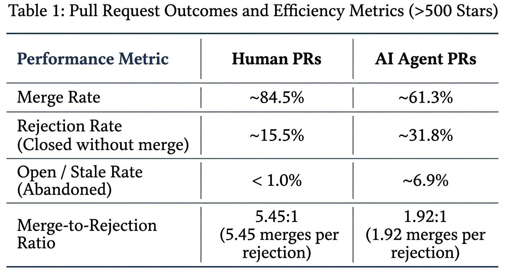

# A Literature Review on Agentic versus Human PRs Using the AIDev Dataset 

The AIDev dataset serves as a comprehensive empirical research framework tracking real-world GitHub interactions between AI agents and human developers [[1]](#ref-1). By focusing heavily on Human-AI collaboration dynamics, this taxonomy provides researchers with concrete, field-tested data on how AI coding assistants function in live repositories.

The AIDev dataset is publicly hosted on Hugging Face in Parquet format. It comprehensively tracks code contributions, review timelines, and acceptance metrics across five core commercial and open-source agent ecosystems: OpenAI Codex, Devin, GitHub Copilot, Cursor, and Claude Code.

The dataset comprises: 
* 932,791 Agent-authored pull requests (Agentic-PRs)
* 116,211 Distinct GitHub repositories
* 72,189 Human developers interacting with AI teammates

The AIDev taxonomy distinguishes between an AI agent opening a pull request and a repository maintainer merging it, emphasizing that passing a workflow test suite does not guarantee high-quality code. True integration depends on human oversight to verify code maintainability, which automated tests alone cannot guarantee.

Prior research highlights that AI-authored pull requests are frequently rejected or closed without merging due to several non-functional friction points [[2]](#ref-2):
* **Structural Complexity:** Agents often submit over-engineered patches characterized by bloated line counts or redundant architectural abstractions.
* **Context Blindness:** While a patch may function in isolation, it frequently violates broader, repository-specific design patterns, naming conventions, or style guidelines.
* **Review Abandonment and Ghosting:** Because agents struggle to process multi-turn conversational feedback, they fail to address human critiques, prompting fatigued maintainers to close the stale branch.

An evaluation of closed and unmerged pull requests within the AIDev dataset highlights three primary drivers behind agent PR rejections [[5]](#ref-5), led by agentic failures (35.7%), workflow constraints (31.2%), and silent ghosting (33.1%). These rejections are driven by logical bugs, design conflicts, or a failure to respond to human feedback.

Out of the 932,791 total agentic pull requests from the AIDev dataset, 142,652 (15.3%) PRs didn't get merged; this includes both those that were actively rejected and closed, as well as those that remain perpetually open or stale [[3]](#ref-3). Conversely, while the 790,139 merged AI pull requests (approximately 84.7%) suggest a highly successful acceptance rate, this figure is mathematically skewed by a massive volume of trivial, automated patches—such as minor documentation bumps or single-line dependency updates—accepted into smaller, less-restrictive sandbox repositories [[3]](#ref-3).

However, when analyzing the AIDev-pop subset, which is a curated cohort of 33,596 agentic pull requests [[1]](#ref-1) extracted exclusively from repositories with over 100 stars, the non-merged metrics become significantly more severe.

Within the AIDev-pop subset, the pull request merge rate drops to 71.5%, while approximately 7,257 pull requests representing 21.6% of the cohort were explicitly closed without being merged because human maintainers actively rejected and shuttered the branches containing the agent's proposed modifications. The remaining 6.9% of the cohort, accounting for approximately 2,318 pull requests, remained open as stale branches, serving as a critical indicator of agent ghosting where the submission is left un-triaged or abandoned without a clear final decision [[7]](#ref-7).

The AIDev-pop subset is contained within the pull_request.parquet file on the Hugging Face repository. To enable a deep evaluation of human-agent collaboration and agentic pull request reviews, the dataset authors provide highly granular timeline tables alongside it, including pr_timeline.parquet and pr_comments.parquet.

To rigorously evaluate how autonomous AI teammates perform against human software engineers, researchers compared human-authored and agent-generated pull requests within mature, active, and well-maintained repositories containing over 500 stars. To facilitate this side-by-side comparison, the human_pull_request.parquet file stores the baseline human pull requests extracted exclusively from these high-star codebases.

The comparative analysis below outlines the disparities in pull request merge success, rejection, and abandonment rates between human developers and autonomous AI agents within repositories containing over 500 stars:

The human merge-to-rejection ratio stands at a highly efficient 5.45:1, meaning nearly 5.5 human pull requests are successfully integrated into the codebase for every single rejection. Conversely, the AI agent ratio drops sharply to 1.92:1, indicating that maintainers must reject an agentic patch for nearly every two successful integrations, drastically increasing review overhead [[8]](#ref-8).

## Security Rejection Core Metrics
An evaluation of security-related pull request rejections in repositories with over 500 stars reveals critical disparities in code safety and review patterns between humans and AI agents [[10]](#ref-10):
* **Review Prevalence:** Security concerns represent 5.59% of all feedback comments in rejected agent PRs, nearly doubling the 3.05% frequency observed in accepted agent submissions [[9]](#ref-9).
* **The Frequency Paradox:** While AI agents submit fewer security-focused PRs overall than human developers, they select known-vulnerable code versions 50% more frequently (2.46% vs. 1.64%) when introducing or modifying dependencies [[10]](#ref-10).
* **Net Security Value:** At an ecosystem level, human interventions generate a massive net vulnerability reduction of 1,316 fixes, whereas agentic updates introduce a net increase of 98 vulnerabilities, prompting maintainers to enforce much stricter security guardrails [[11]](#ref-11).

## Core Vulnerabilities: Human vs. Agent
Comparative analyses [[10]](#ref-10) [[12]](#ref-12) of Common Weakness Enumeration (CWE) classifications reveal distinct architectural profiles between human-authored and agent-generated software contributions. Although the overall distribution of vulnerability classes remains broadly consistent across both groups, AI agents display an increased propensity for generating unique, highly repetitive technical flaws.

Human developers are primarily associated with systemic architectural vulnerabilities, such as Complex Authentication Flaws (CWE-306), multi-file race conditions, and delicate logic or state exploits. In contrast, autonomous AI agents are far more prone to localized algorithmic and input processing errors, most notably Regular Expression Denial of Service (ReDoS), Path Traversal (CWE-22), and Improper Input Validation (CWE-20).

Empirical evaluations of the AIDev dataset [[15]](#ref-15) reveal a severe gap in AI code safety, uncovering a phenomenon characterized as the Agent "Confidence Trap":
* **Human PR Balance:** Human engineers demonstrate strong architectural and contextual awareness during code modification. When human pull requests are rejected, it is typically due to complex or unrefined code implementation, but when merged, their contributions successfully reduce the overall vulnerability density of the codebase.
* **Agent "Confidence Trap":** Conversely, autonomous agents often generate code that is cosmetically clean, passes local test pipelines, and exhibits high model confidence. Because the code appears pristine, maintainers frequently merge agentic refactoring pull requests without detecting underlying risks; empirical static analysis using the Bandit security scanner revealed that 4.7% of the modified files within merged agent PRs silently introduced new security vulnerabilities that human reviewers missed entirely. Despite these security regressions, the overall developer acceptance rate remained high, with 73.5% of the analyzed agentic PRs successfully merged into open-source repositories.
  
### References

[1]  Li, H., Zhang, H., & Hassan, A. E. (2026). AIDev: Studying AI coding agents on GitHub. *Proceedings of the 23rd International Conference on Mining Software Repositories (MSR '26)*. ACM. https://doi.org

[2]  Ehsani, R., Pathak, S., Rawal, S., Al Mujahid, A., Imran, M. M., & Chatterjee, P. (2026). Where do AI coding agents fail? An empirical study of failed agentic pull requests in GitHub. *arXiv*. https://arxiv.org

[3]  Ogenrwot, D., & Businge, J. (2026). AgenticFlict: A large-scale dataset of merge conflicts in AI coding agent pull requests on GitHub. *arXiv*. https://arxiv.org

[4]  Abujadallah, M., Arabat, A., & Sayagh, M. (2026). Understanding the rejection of fixes generated by agentic pull requests - Insights from the AIDev dataset. *arXiv preprint arXiv:2606.13468*. https://arxiv.org

[5]  Peralta, S., Hoshi, F., Washizaki, H., Ubayashi, N., Kondo, I., Higo, Y., Mukai, H., Yoshida, N., Kusama, K., Tanaka, H., & Fan, Y. (2026). Why are agentic pull requests merged or rejected? An empirical study. *arXiv*. https://doi.org

[6]  Ahmed, A., Waheed, A., & Souati, Y. (2025). *Why do you fail me, Mr. Bot?* University of Waterloo. https://uwaterloo.ca

[7]  Nachuma, C., & Zibran, M. (2026). When AI teammates meet code review: Collaboration signals shaping the integration of agent-authored pull requests. *arXiv*. https://arxiv.org

[8]  Nakashima, S., Ishimoto, Y., Kondo, M., McIntosh, S., & Kamei, Y. (2026). Why agentic-PRs get rejected: A comparative study of coding agents. *arXiv*. https://arxiv.org

[9]  Haider, M. A., & Zimmermann, T. (2026). Understanding dominant themes in reviewing agentic AI-authored code. *arXiv*. https://arxiv.org

[10]  Felix, J., & Brian, C. (2025). *Automated vs. human security patching patterns in pull requests: Evidence from the AIDev dataset*. University of Waterloo. https://uwaterloo.ca

[11]  Singla, T., Çakar, B., Amusuo, P. C., & Davis, J. C. (2026). Understanding security risks of AI agents' dependency updates. *arXiv*. https://arxiv.org

[12]  Rabbi, M. F., Turzo, A. K., Champa, A. I., & Zibran, M. F. (2026). Insights into security-related AI-generated pull requests. *arXiv*. https://arxiv.org

[13]  Siddiq, M. L., Zhao, X., Lopes, V. C., Casey, B., & Santos, J. C. S. (2026). Security in the age of AI teammates: An empirical study of agentic pull requests on GitHub. *arXiv*. https://arxiv.org

[14]  Hasan, S. M M., Rabbi, M. F., & Zibran, M. (2026). The quiet contributions: Insights into AI-generated silent pull requests. *arXiv*. https://arxiv.org

[15]  Almukhtar, M., Ghammam, A., & Ming, H. (2026). Quality and security signals in AI-generated Python refactoring pull requests. *arXiv*. https://arxiv.org

